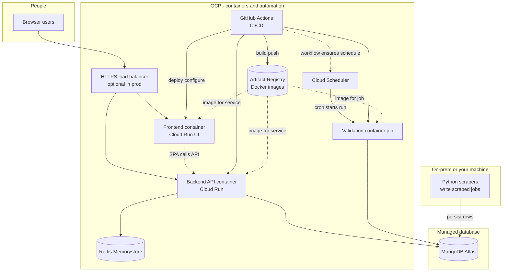
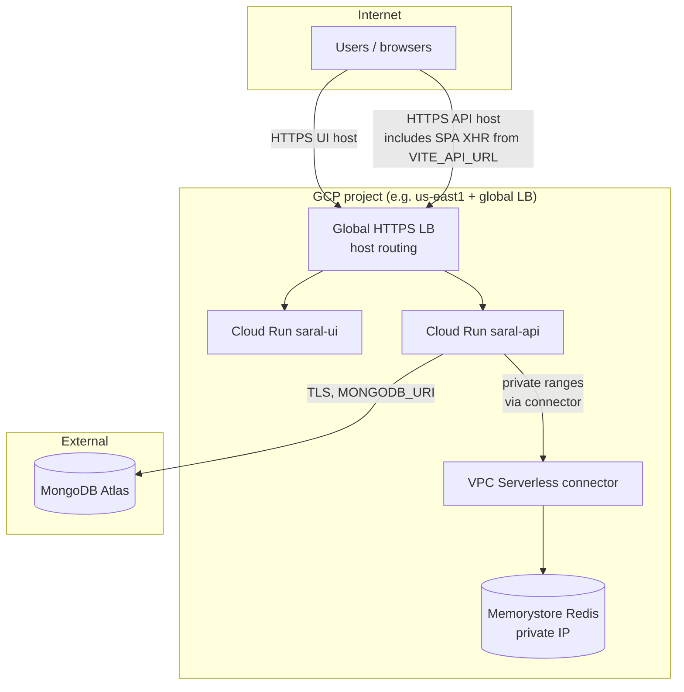
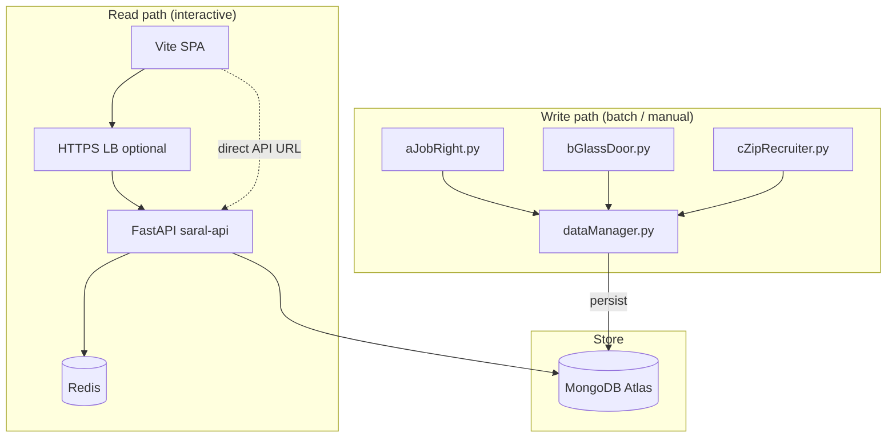
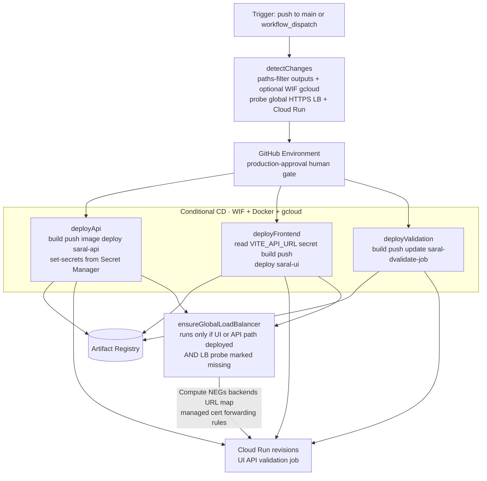

# Architecture diagrams

Resource names, secrets, and workflow matrix: [`GCP-PLATFORM-KT.md`](./GCP-PLATFORM-KT.md).

---

## 1. Big picture — on-prem scrapers, cloud, data, scheduler, GitHub Actions

Not a deep dive: **where** things run, **what** talks to MongoDB, **Artifact Registry** as the image store between CI and Cloud Run, and **who triggers** deploys vs nightly validation.

---

## 2. Connectivity — load balancer, API, Redis, and database

---

## 3. Scraper ingress vs API / UI egress

**Writers:** Python scrapers use **`utils/dataManager.py`** and land rows in **MongoDB** (same Atlas cluster the API uses). **Readers:** the SPA loads jobs through the **API** (Redis-backed where enabled), not by talking to Mongo directly.

---

## 4. Deploy — `Main Deploy` workflow (approval, push, LB)

Source of truth: **`.github/workflows/deployment.yml`**. No CI/CodeQL gate — deploy runs after **`detectChanges`** and **`production-approval`**. Secrets, IAM, and command-level detail: [`CICD-FULL-STACK.md`](./CICD-FULL-STACK.md). **Workload Identity Federation** + **`google-github-actions/auth`** mint short-lived GCP credentials for the **pipeline** service account (no JSON key in the repo).

**Edges in words:** **`detectChanges`** waits for **CI** and **CodeQL** to finish with compatible results (see workflow `if:`), then sets which of **`deployApi`** / **`deployFrontend`** / **`deployValidation`** run. Each deploy job **authenticates with WIF**, pushes to **Artifact Registry**, and **`gcloud run deploy`** (or job update). **`ensureGlobalLoadBalancer`** is a separate job that runs **after** API and UI deploy jobs succeed or skip, **only** when change detection said the LB stack was missing or incomplete.
