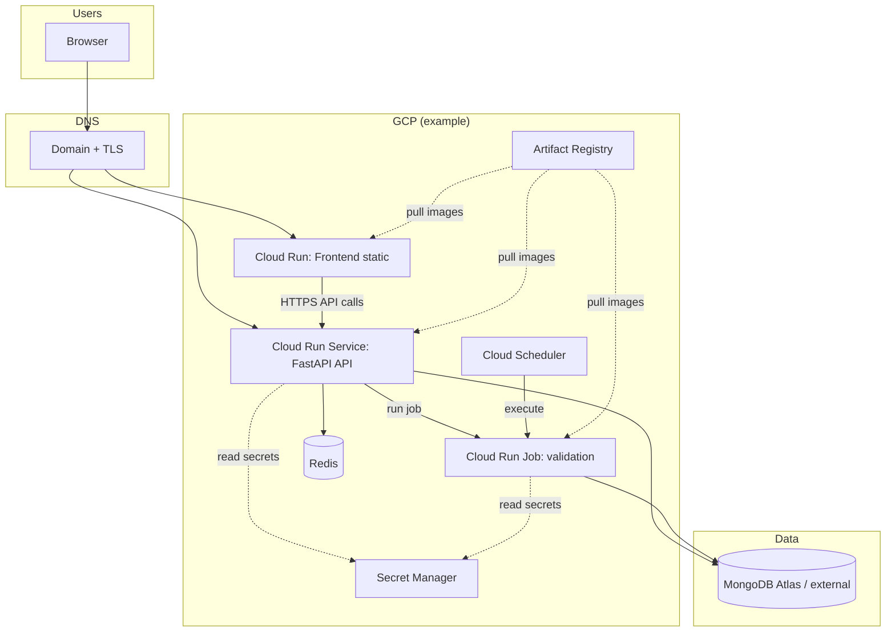
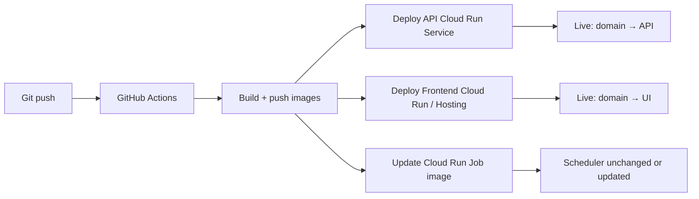

# Full-stack CI/CD plan (short)

Goal: **automate deploys** for the **FastAPI backend**, **Vite React frontend**, **Redis**, existing **Cloud Run Job** (`validation.py` verify/apply), **custom domain**, and **secrets** — without committing `gcp-sa.json` to git.

---

## Already done (validation job + GCP automation)

This is **implemented in the repo today**; you can treat it as finished unless you want tweaks.

| Item | Where |
|------|--------|
| **Workload Identity Federation** for GitHub → GCP | `deployValidation.yml` / `runValidationManual.yml` use `google-github-actions/auth@v2` with `GCP_WORKLOAD_IDENTITY_PROVIDER` + `GCP_SERVICE_ACCOUNT`. |
| **Build & push** validation image | `docker/Dockerfile.validation` → Artifact Registry (`saral-job-viewer-cr/dvalidate`), tag `latest` + `$GITHUB_SHA`. |
| **Cloud Run Job** create/update | `saral-dvalidate-job` with secrets: `MONGODB_URI`, `MIDHTECH_EMAIL`, `MIDHTECH_PASSWORD` from **Secret Manager**. |
| **Cloud Scheduler** | Daily `00:00` UTC HTTP trigger to run the job (OAuth as deploy SA). |
| **Manual runs** | `runValidationManual.yml` — pick mode `1`/`2`, optional wait for completion. |
| **Trigger** | Job deploy workflow is **`workflow_dispatch` only** (push to `main` is commented out). |

**Optional polish (not required):** uncomment `on.push` in `deployValidation.yml` if you want every merge to `main` to roll a new job image automatically.

---

## Next steps (what to do next) — human order

Everything below is **not** covered by the validation-job workflows; this is the real gap for “full product” CI/CD.

1. **Backend API on GCP** — Add a workflow (or job) that builds **`docker/Dockerfile.api`**, pushes to Artifact Registry, runs **`gcloud run deploy`** for a **Cloud Run Service** (not Job). Wire env/secrets: `MONGODB_*`, `JWT_SECRET`, `GCP_PROJECT_ID`, `GCP_REGION`, `RUN_JOB_NAME`, Midhtech if needed, `REDIS_URL` when Redis exists.
2. **Runtime identity for the API** — Attach a **Cloud Run service account** to that service. Grant it permission to **`run.jobs.run`** (or equivalent) on `saral-dvalidate-job` so admin “trigger job” works **without** mounting `gcp-sa.json`.
3. **Redis** — Choose **Memorystore + VPC connector** or a **hosted Redis URL** (e.g. Upstash). Put `REDIS_URL` in Secret Manager; reference it on the API service. Until then, API can run with `REDIS_ENABLED=false` or your current behavior.
4. **Frontend** — CI: `npm ci && npm run build` with **`VITE_API_URL`** set to the **public API URL**. Deploy: second **Cloud Run service** (nginx serving `dist/`), **Firebase Hosting**, or **GCS + LB** — pick one and automate it in Actions.
5. **Domain** — Map DNS to Cloud Run (custom domain on each service) or put **one HTTPS load balancer** in front of UI + API paths/subdomains; align CORS / cookie / `VITE_API_URL` with that shape.
6. **Retire VPS-only paths for prod** — When API + UI live on GCP, `deploy.sh` becomes optional (dev/disaster only); secrets stay in Secret Manager, not on disk.

---

## What you deploy (runtime)

| Piece | Suggested GCP home | Notes |
|--------|-------------------|--------|
| **Backend API** (`app.py` / `docker/Dockerfile.api`) | **Cloud Run (Service)** | HTTP always-on; set `min-instances` ≥ 1 if you need stable latency / no cold start. |
| **Frontend** (static `vite build`) | **Cloud Run (Service)** with nginx or **Cloud Storage + HTTPS LB**, or **Firebase Hosting** | Simplest ops: tiny container serving `dist/` behind same domain path or subdomain. |
| **Redis** | **Memorystore for Redis** (VPC) or managed Redis (e.g. Upstash) | Cloud Run must reach it: **VPC connector** + private IP, or use a **public TLS Redis** with auth. |
| **Verify / apply job** (`validation.py` / `docker/Dockerfile.validation`) | **Cloud Run Job** (already in `deployValidation.yml`) | Keep Scheduler + manual runs; API triggers job with a **runtime SA**, not a JSON file in the image. |
| **Domain** | **Cloud Load Balancer** or **Cloud Run domain mappings** | One domain: e.g. `api.example.com` → API service, `app.example.com` or `/` → frontend. Map SSL in LB or managed certs on Run. |

---

## Secrets (do not bake `gcp-sa.json` into images)

1. **Remove keys from the repo.** Rotate any key that ever appeared in chat or history.
2. **GitHub Actions → GCP:** prefer **Workload Identity Federation (OIDC)** so workflows use short-lived tokens (no JSON key in `GH_SECRET`).
3. **Runtime secrets on Cloud Run:** mount from **Secret Manager** (`MONGODB_URI`, `MIDHTECH_*`, `JWT_SECRET`, `REDIS_URL`, optional `GOOGLE_APPLICATION_CREDENTIALS` only if you must use a file — better: **attach the Cloud Run service account** with IAM roles and drop the JSON entirely for the API).
4. **Triggering the validation job:** grant the **API service account** `roles/run.developer` (or narrower) on the job so `JobsClient` works **without** a downloaded key inside the container.

---

## CI/CD tasks (checklist)

**One-time GCP**

- [ ] Enable APIs: Run, Artifact Registry, Secret Manager, (VPC + Serverless VPC Access if Memorystore), IAM Credentials (OIDC).
- [ ] Artifact Registry repos (e.g. one repo: `saral-job-viewer-cr` — already used for `dvalidate`).
- [ ] Create runtime SAs: `api-run-sa`, `job-run-sa`; bind least-privilege IAM.
- [ ] Store secrets in Secret Manager; reference them from Cloud Run service/job.
- [ ] Redis: provision + network path from Cloud Run (connector or external Redis).
- [ ] DNS + SSL (LB or Run-managed).

**GitHub**

- [ ] Add **OIDC** workload identity provider + trust GitHub repo.
- [ ] Workflow: build/push **API image** (`docker/Dockerfile.api`), **frontend image** (or upload `dist/`), **dvalidate image** (existing).
- [ ] Workflow: `gcloud run deploy` for API + frontend services; `gcloud run jobs update` for job (existing pattern in `deployValidation.yml`).
- [ ] Optional: staging branch / manual approval for production.

**App config**

- [ ] Frontend: set `VITE_API_URL` at **build time** to public API URL (or same-origin if reverse-proxied).
- [ ] Backend: `REDIS_URL`, Mongo, Midhtech, `GCP_*`, `RUN_JOB_NAME` via env/Secret Manager only.

---

## Architecture (runtime)

---

## CI/CD flow (on push to `main`)

---

## Suggested repo layout for workflows

- Keep **`deployValidation.yml`** pattern for the **job** image.
- Add **`deployApi.yml`**: build `docker/Dockerfile.api`, deploy Cloud Run service, set secrets.
- Add **`deployFrontend.yml`**: build `docker/Dockerfile.frontend` (Vite + nginx), deploy Cloud Run service; Secret Manager **`VITE_API_URL`** for the API base URL at build time (see **`DeployFrontendWindows.md`**).

You can merge into one workflow with **matrix** or **jobs** if you prefer a single “deploy all” button.

---

## References in this repo

- Inventory vs gaps: **`PROJECT-STATUS-CHECKLIST.md`**, **`GCP-INVENTORY-WINDOWS.md`** (this folder)
- Job + scheduler: `gcpCloudRun.md`, `.github/workflows/deployValidation.yml`
- API container: `docker/Dockerfile.api`, `deploy.sh` (VPS path — replace with Cloud Run for “full GCP”)
- Frontend container: `docker/Dockerfile.frontend`, `docker/nginx.frontend.conf`
- Job container: `docker/Dockerfile.validation`, `docker-compose.yml`

---

*Last updated: aligns with Saral Job Viewer stack (FastAPI, Vite, MongoDB, Redis, Cloud Run Job). Adjust regions and names to match your project.*
