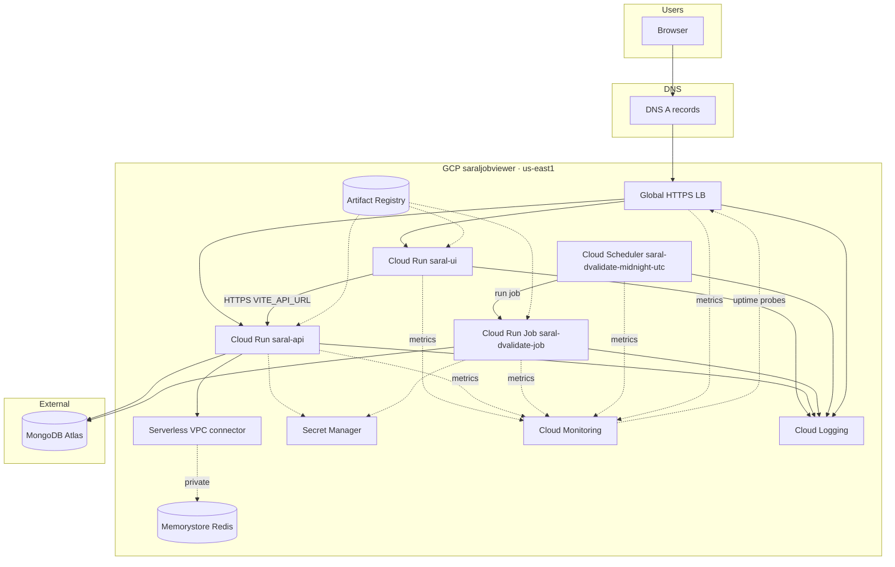

# Full-stack CI/CD — Saral Job Viewer

**Status:** Implemented end-to-end — **FastAPI** + **Vite** on **Cloud Run**, **Memorystore Redis**, **validation job** + **Scheduler**, **WIF** from GitHub Actions, **Secret Manager**, **custom domains** (`saral.*` + `saralapi.*` on `thatinsaneguy.com`), **global HTTPS external load balancer** (optional bootstrap via prereq; DNS **A** to LB IP where used). **Cloud Monitoring** dashboard + uptime checks + alert policies are applied via **`setupMonitoring.yml`** (embedded JSON/YAML). No `gcp-sa.json` in images for production paths.

---

## Implemented (reference)

| Area | Details |
|------|---------|
| **GitHub → GCP** | OIDC: `GCP_WORKLOAD_IDENTITY_PROVIDER`, `GCP_SERVICE_ACCOUNT`, `GCP_API_RUN_SERVICE_ACCOUNT`. |
| **Main deploy** | **`deployment.yml`** — `detectChanges` → **`production-approval`** (runs on every **`workflow_dispatch`**, or on **`push`** when any path filter matches) → **`deployApi`** / **`deployFrontend`** / **`deployValidation`** in **parallel** (each runs only if its paths changed) → **`ensureGlobalLoadBalancer`** after API **and** UI deploy jobs finish (success or skipped; waits for both so LB never precedes a failed deploy). LB does **not** wait on validation deploy (no shared resource). |
| **Prereq / infra** | **`ensurePrereq.yml`** — enable APIs, verify secrets + Artifact Registry `:latest` images; optional Memorystore + VPC connector; optional Cloud Run **domain mappings**. Does **not** configure the global LB (that runs from **`deployment.yml`** after services exist). |
| **Destroy** | **`destroyStack.yml`** — validate **`DESTROY_SARAL_STACK`** → **`production-approval`** environment → optional LB teardown → parallel Cloud Run **API** / **UI** jobs → validation job + Scheduler → optional domain mappings → Redis then VPC (single ordered job); optional **`deleteGlobalLoadBalancer`**. |
| **Validation** | `docker/Dockerfile.validation` → AR **`dvalidate`**; image/job updates live in **`deployment.yml`**; **`runValidationManual.yml`** for one-off job runs with mode + wait. |
| **Observability** | **`setupMonitoring.yml`** — idempotent Monitoring APIs, uptime list-configs, dashboard **“Saral Job Viewer - Overview”**, notification channel + alert policies (email secret **`MONITORING_ALERT_EMAIL`**); input **`skipNotificationChannelAndAlerts`**. Source of truth is **only** this workflow (no `infra/`). Details: **`MONITORING-WINDOWS-GCLOUD.md`**. |
| **API** | **`deployment.yml`** + `docker/Dockerfile.api` → **`saral-api`**; secrets: Mongo, JWT, Midhtech, `REDIS_URL`; env: `GCP_*`, `RUN_JOB_NAME`, Redis tuning; optional **`GCP_VPC_CONNECTOR_NAME`** (repo variable). |
| **Frontend** | **`deployment.yml`** + `docker/Dockerfile.frontend`, `nginx.frontend.conf` → **`saral-ui`**; **`VITE_API_URL`** from Secret Manager at build. |
| **Redis** | Created/maintained via **`ensurePrereq.yml`** (`ensureRedisInfra`); **`REDIS_URL`** in Secret Manager. Standalone `provisionMemorystoreRedis.yml` removed. |
| **Domains & LB** | Registrar DNS (**A** → LB IP when using global LB); **`VITE_API_URL`** → public API URL (typically `https://saralapi…`). Cloud Run domain mappings optional via **`ensurePrereq`** (`ensureDomainMappings`). LB resource names and flow: **Global Load Balancer** section below. |

---

## Workflows (repo layout)

| Workflow | Role |
|----------|------|
| **`deployment.yml`** | Primary CD: changed-path builds; approval gate; deploy API, UI, validation job + Scheduler; sync LB NEG ↔ backends when applicable. |
| **`ensurePrereq.yml`** | Bootstrap: APIs, secrets/images checks; optional Redis/VPC; optional domain mappings (no LB here). |
| **`destroyStack.yml`** | Teardown: confirm phrase → **`production-approval`** → optional LB → **parallel** API/UI deletes → job + Scheduler → optional mappings → Redis then VPC (ordered); summary job. |
| **`runValidationManual.yml`** | Manual execution of `saral-dvalidate-job` (mode + optional wait). |
| **`setupMonitoring.yml`** | Manual: Monitoring APIs, uptime checks, dashboard + alert policies (**embedded**); secret **`MONITORING_ALERT_EMAIL`**; input **`skipNotificationChannelAndAlerts`**. |

---

## Runtime map

| Component | GCP | Notes |
|-----------|-----|-------|
| Backend | Cloud Run **`saral-api`** | HTTP; runtime SA; VPC connector if Memorystore |
| Frontend | Cloud Run **`saral-ui`** | Static nginx on port 8080 |
| Redis | Memorystore + VPC connector | `REDIS_URL` secret |
| Validation | Cloud Run **job** `saral-dvalidate-job` | Scheduler + manual |
| TLS | Managed certs | At **LB** (SAN cert) and/or **Cloud Run domain mappings** |
| Edge | **Global HTTPS LB** (optional but implemented) | Host routing → serverless NEGs → Run |
| Observability | **Cloud Monitoring** + **Logging** | Dashboard/uptime/alerts from **`setupMonitoring.yml`**; workloads emit logs automatically |

---

## Global Load Balancer (implemented)

Implemented in **`deployment.yml`** (`ensureGlobalLoadBalancer` job after **`deployApi`** / **`deployFrontend`**) and **`destroyStack.yml`** (`deleteGlobalLoadBalancer`):

- Single global IPv4 (**`sjv-global-lb-ip`**) with HTTPS (:443) + HTTP (:80) forwarding rules.
- Target proxies + **`sjv-host-routing`** URL map: **`saral.thatinsaneguy.com`** → UI backend + NEG → **`saral-ui`**; **`saralapi.thatinsaneguy.com`** → API backend + NEG → **`saral-api`**.
- Google-managed certificate **`sjv-managed-cert`** on the HTTPS proxy.

**CI/CD**

- Create/update LB: end of **`deployment.yml`**, job **`ensureGlobalLoadBalancer`**, after **`deployApi`** / **`deployFrontend`** (so Cloud Run exists). Runs when **`api`** or **`frontend`** paths changed, or on **`workflow_dispatch`** when input **`ensureGlobalLoadBalancer`** is checked (default on).
- Remove LB: **`destroyStack.yml`** with **`deleteGlobalLoadBalancer`**.

**Optional later:** Cloud Armor, Cloud CDN, remove redundant Cloud Run domain mappings after LB-only cutover.

##### Cloud Run domain mappings — “domain does not appear to be verified” / “no verified domains”

**`ensurePrereq.yml`** can create **`gcloud beta run domain-mappings`** when **`ensureDomainMappings`** is **true**. That path is **optional** and separate from the **global HTTPS load balancer**:

| Mechanism | What you need | Who serves TLS |
|-----------|----------------|----------------|
| **Global LB** (from **`deployment.yml`**) | Registrar **A** records for `saral` / `saralapi` → global static IP **`sjv-global-lb-ip`** (resolve with `gcloud compute addresses describe sjv-global-lb-ip --global --project saraljobviewer --format=value(address)`). | Managed cert on the LB |
| **Cloud Run domain mappings** | Google must treat the **same identity** that runs `gcloud` as having verified the hostnames. In **GitHub Actions** that identity is the **pipeline service account** (`GCP_SERVICE_ACCOUNT` via WIF), not your personal Google login. A record at the registrar **does not** satisfy Cloud Run’s verification check. | Managed cert on Cloud Run mapping |

**If you already use the global LB + DNS:** leave **`ensureDomainMappings`** at **`false`** (default). You do **not** need Cloud Run domain mappings for production traffic.

**If you still need domain mappings from CI:** verify ownership in a way that applies to the pipeline SA (advanced), or create mappings **once** from your machine while logged in as a user that has verified the domains (`gcloud auth login`), then keep **`ensureDomainMappings`** off in CI.

**Typical GCP object names** (must match workflows if you rename): global IP `sjv-global-lb-ip`; cert `sjv-managed-cert`; NEGs `sjv-ui-neg` / `sjv-api-neg`; backends `sjv-ui-bes` / `sjv-api-bes`; URL map `sjv-host-routing`; proxies `sjv-https-proxy` / `sjv-http-proxy`; forwarding rules `sjv-https-fr` / `sjv-http-fr`.

##### IAM for **`ensureGlobalLoadBalancer`** (fixes `compute.globalAddresses.create` denied)

The **deploy / WIF** service account (**`GCP_SERVICE_ACCOUNT`** in GitHub secrets — not the Cloud Run runtime SA) must be allowed to create Compute load balancer resources. If permission is missing you see:

`Required 'compute.globalAddresses.create' permission for 'projects/…/global/addresses/sjv-global-lb-ip'`

Bind these roles on project **`saraljobviewer`** to that pipeline SA (use the same email as **`GCP_SERVICE_ACCOUNT`**):

```bash
PROJECT=saraljobviewer
SA="YOUR_PIPELINE_SA@YOUR_PROJECT_ID.iam.gserviceaccount.com"

gcloud projects add-iam-policy-binding "${PROJECT}" \
  --member="serviceAccount:${SA}" \
  --role="roles/compute.networkAdmin"

gcloud projects add-iam-policy-binding "${PROJECT}" \
  --member="serviceAccount:${SA}" \
  --role="roles/compute.loadBalancerAdmin"
```

- **`roles/compute.networkAdmin`** — global/regional addresses and related networking objects LB creation touches.
- **`roles/compute.loadBalancerAdmin`** — URL maps, backend services, forwarding rules, target proxies, managed SSL certs on Compute.

Wait for IAM to propagate, then rerun **`deployment.yml`**.

---

## Secrets (summary)

- **Secret Manager:** `MONGODB_URI`, `MIDHTECH_*`, `JWT_SECRET`, `REDIS_URL`, `VITE_API_URL`; Mongo DB name also set as env on services in deploy scripts.
- **GitHub:** WIF secrets above; **Variable** `GCP_VPC_CONNECTOR_NAME` when API uses Memorystore via VPC; **`MONITORING_ALERT_EMAIL`** when using alerting in **`setupMonitoring.yml`**.

---

## CI/CD checklist (mainline)

**GCP**

- [x] APIs: Run, Artifact Registry, Secret Manager, Scheduler, IAM Credentials (WIF), Redis, VPC Access, Compute, Certificate Manager (as needed for LB), Monitoring/Logging (via **`setupMonitoring.yml`** or Console).
- [x] Artifact Registry `saral-job-viewer-cr`.
- [x] Service accounts + IAM (deploy, runtime, `actAs`, Secret Manager, Run job).
- [x] Secrets + Cloud Run bindings.
- [x] Redis + connector + `REDIS_URL`.
- [x] Custom DNS + HTTPS (LB and/or domain mappings).
- [x] Global HTTPS LB + host routing (where prereq/manual setup applied).

**GitHub**

- [x] OIDC + repository secrets/variables.
- [x] **`deployment.yml`**, **`ensurePrereq.yml`**, **`destroyStack.yml`**, **`runValidationManual.yml`**, **`setupMonitoring.yml`**.
- [x] Approval gate via **`production-approval`** on **`deployment.yml`** when filtered paths change.
- [ ] Optional: staging env, stricter path triggers, Cloud Armor/CDN automation.

**App**

- [x] `VITE_API_URL` at frontend build time (update secret + redeploy frontend when it changes).
- [x] Backend env/secrets via deploy steps in **`deployment.yml`**.

---

## Architecture



---

## References

- **`GCP-PLATFORM-KT.md`** — onboarding / architecture: services, names, traffic and credential flows, which workflow touches what.
- **`MONITORING-WINDOWS-GCLOUD.md`** — monitoring concepts, **`setupMonitoring.yml`** IAM, optional Windows **`gcloud`**, LB/dashboard troubleshooting, **`loadTest.py`**.
- **`PROJECT-STATUS-CHECKLIST.md`** — line-item status + optional polish; keep in sync with workflow changes.
- **Workflows:** `.github/workflows/deployment.yml`, `ensurePrereq.yml`, `destroyStack.yml`, `runValidationManual.yml`, `setupMonitoring.yml`.
- **Local:** `docker-compose.yml`, `docker/Dockerfile.*`, **`loadTest.py`** (optional HTTP stress / alert validation).

---

*Last updated: 2026-05 — monitoring consolidated into **`MONITORING-WINDOWS-GCLOUD.md`**; **`MONITORING-OBSERVABILITY.md`** removed as superseded.*
