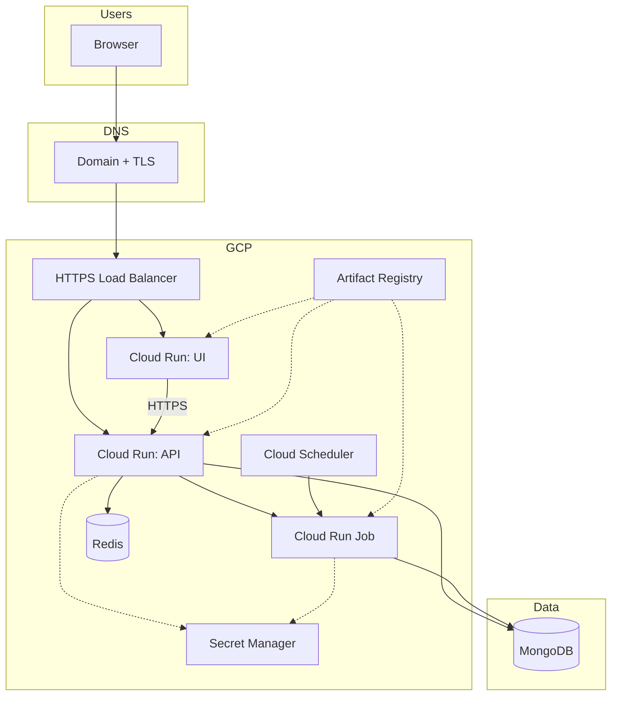

# Full-stack CI/CD — Saral Job Viewer

**Status:** Implemented end-to-end — **FastAPI** + **Vite** on **Cloud Run**, **Memorystore Redis**, **validation job** + **Scheduler**, **WIF** from GitHub Actions, **Secret Manager**, **custom domains** (typical: `saral.*` + `saralapi.*` on `thatinsaneguy.com`). No `gcp-sa.json` in images for production paths.

---

## Implemented (reference)

| Area | Details |
|------|---------|
| **GitHub → GCP** | OIDC: `GCP_WORKLOAD_IDENTITY_PROVIDER`, `GCP_SERVICE_ACCOUNT`, `GCP_API_RUN_SERVICE_ACCOUNT`. |
| **Validation** | `docker/Dockerfile.validation` → AR `dvalidate`; `deployValidation.yml` updates job + Scheduler; `runValidationManual.yml` for one-off runs. |
| **API** | `deployApi.yml`, `docker/Dockerfile.api` → **`saral-api`**; secrets: Mongo, JWT, Midhtech, `REDIS_URL`; env: `GCP_*`, `RUN_JOB_NAME`, Redis tuning; optional **`GCP_VPC_CONNECTOR_NAME`**. |
| **Frontend** | `deployFrontend.yml`, `docker/Dockerfile.frontend`, `nginx.frontend.conf` → **`saral-ui`**; **`VITE_API_URL`** from Secret Manager at build (you maintain the secret). |
| **Redis** | `provisionMemorystoreRedis.yml`; **`REDIS_URL`**; idempotent secret / IAM updates. |
| **Domains** | Cloud Run domain mappings + DNS; **`VITE_API_URL`** points at public API hostname. See **`CustomDomainCloudRun.md`** if you add or change hosts. |

**Optional:** uncomment `on.push` in `deployValidation.yml` (or add for API/UI) for merge-to-main deploys.

---

## Workflows (repo layout)

| Workflow | Role |
|----------|------|
| `deployValidation.yml` | Job image + Cloud Scheduler |
| `deployApi.yml` | **`saral-api`** (does not write `VITE_API_URL`) |
| `deployFrontend.yml` | **`saral-ui`** |
| `provisionMemorystoreRedis.yml` | Connector + `REDIS_URL` |
| `runValidationManual.yml` | Manual job execution |

---

## Runtime map

| Component | GCP | Notes |
|-----------|-----|--------|
| Backend | Cloud Run **`saral-api`** | HTTP; attach runtime SA; VPC if Memorystore |
| Frontend | Cloud Run **`saral-ui`** | Static nginx on port 8080 |
| Redis | Memorystore + VPC connector | `REDIS_URL` secret |
| Validation | Cloud Run **job** | Scheduler + manual; Mongo secrets |
| TLS | Managed certs | Per Cloud Run domain mapping or `*.run.app` |

---

## Add Global Load Balancer (recommended)

You can add a Google Cloud HTTPS Load Balancer in front of UI/API for cleaner routing, centralized TLS/WAF, and better traffic orchestration.

### Target design

- Single external HTTPS LB entrypoint
- Host/path routing:
  - `saral.thatinsaneguy.com` -> UI Cloud Run service
  - `saralapi.thatinsaneguy.com` (or `/api/*`) -> API Cloud Run service
- Google-managed SSL cert(s) at LB
- Optional Cloud Armor policy for IP/rate/WAF controls
- Optional CDN for UI paths

### Why this helps

- Central policy point (TLS, redirects, security headers, WAF)
- Easier future multi-service routing
- Better zero-downtime traffic cutovers by changing LB backend targets

### Migration plan (safe)

1. Keep existing Cloud Run domain mappings active.
2. Create LB + serverless NEGs for `saral-ui` and `saral-api`.
3. Validate LB with temporary hostnames.
4. Move DNS to LB IP.
5. After stable traffic period, optionally remove direct Cloud Run domain mappings.

### CI/CD orchestration impact

- Keep existing deploy workflows (`deployApi.yml`, `deployFrontend.yml`, `deployValidation.yml`).
- Add one new infra workflow for LB config:
  - create/update serverless NEGs
  - URL map + target proxy + cert + forwarding rule
  - Cloud Armor policy attach (optional)
- Deploy order for app updates can remain:
  - deploy API/UI image first
  - LB unchanged unless routing/policy changed

### Do we need a diff script?

No mandatory diff script is needed.

- Existing path-based deploy selection + workflow gating is enough for app deploys.
- For LB infra changes, use:
  - dedicated workflow on `.github/workflows/**` or `infra/**` path changes, or
  - manual `workflow_dispatch` for explicit control.

---

## Secrets (summary)

- **Secret Manager:** `MONGODB_URI`, `MONGODB_DATABASE` (env on services), `MIDHTECH_*`, `JWT_SECRET`, `REDIS_URL`, `VITE_API_URL`.
- **GitHub:** WIF + three secrets above; **Variable** `GCP_VPC_CONNECTOR_NAME` when using Memorystore from API.

---

## CI/CD checklist (mainline — all done)

**GCP**

- [x] APIs: Run, Artifact Registry, Secret Manager, Scheduler, IAM Credentials (WIF), Redis, VPC Access, Compute as needed.
- [x] Artifact Registry `saral-job-viewer-cr`.
- [x] Service accounts + IAM (deploy, runtime, `actAs`, Secret Manager, Run job, Redis/VPC provisioning).
- [x] Secrets + Cloud Run bindings.
- [x] Redis + connector + `REDIS_URL`.
- [x] Custom domain DNS + mappings + HTTPS (where you use custom hosts).

**GitHub**

- [x] OIDC + repository secrets/variables.
- [x] All workflows listed above.
- [ ] Optional: push triggers, staging, approval gates.
- [ ] Optional: add LB infra workflow (serverless NEG + URL map + cert + forwarding rule).

**App**

- [x] `VITE_API_URL` at frontend build time (manual secret updates + run `deployFrontend` when it changes).
- [x] Backend env/secrets via `deployApi` / job definitions.

---

## Architecture

---

## References

- **`PROJECT-STATUS-CHECKLIST.md`** — line-item status + optional polish.
- **`CustomDomainCloudRun.md`** — domain verification, mappings, DNS.
- **`GCP-INVENTORY-WINDOWS.md`** — re-scan commands.
- `gcpCloudRun.md`, `docker-compose.yml`, Dockerfiles under `docker/`.

---

*Last updated: 2026-05 — production CI/CD path complete; optional items are automation / tuning only.*
