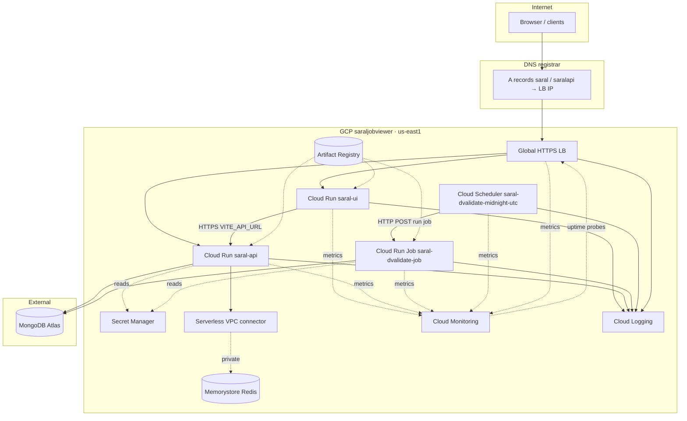

# GCP platform guide — services, names, and workflows (KT)

This document is for **learning, onboarding, and architecture reviews**. It explains **which Google Cloud services we use**, **why**, **how they connect**, and **how GitHub Actions workflows** interact with them.

Companion docs:

- **`ARCHITECTURE-DIAGRAMS.md`** — Mermaid diagrams: **big-picture** overview, connectivity (API Redis Mongo), scraper write path vs API read path, **Main Deploy** CI/CD phases (CI, CodeQL, WIF, Artifact Registry, LB ensure).
- **`CICD-FULL-STACK.md`** — workflow cheat sheet, secrets, LB IAM commands, architecture diagram.
- **`MONITORING-WINDOWS-GCLOUD.md`** — monitoring scope (dashboard/uptime/alerts from **`setupMonitoring.yml`**), optional Windows **`gcloud`**, IAM, troubleshooting.
- **`PROJECT-STATUS-CHECKLIST.md`** — what is done vs optional.

---

## 1. Big picture

**Saral Job Viewer** runs as:

- A **Python FastAPI** backend and **Vite** frontend on **Cloud Run** (always-on HTTP services).
- A **Python validation** pipeline as a **Cloud Run Job** triggered on a schedule and manually.
- **MongoDB** hosted outside GCP (**MongoDB Atlas**).
- **Redis** on GCP (**Memorystore**) for API caching, reachable only via **VPC**.
- **Secrets** in **Secret Manager** (never baked into images for production paths).
- Images in **Artifact Registry**; deploy identity via **Workload Identity Federation** from GitHub.
- Optional **global HTTPS load balancer** in front of the UI and API with **custom domains** at the registrar.

---

## 2. GCP project and region

| Item | Value | Why |
|------|--------|-----|
| **Project ID** | `saraljobviewer` | Single project for app + infra used by these workflows. |
| **Region** | `us-east1` | Cloud Run services, job, Scheduler, Redis, VPC connector, serverless **regional** NEGs. Global LB resources are **global** but attach to regional NEGs here. |

---

## 3. Identity and access (who calls GCP)

### 3.1 GitHub Actions → GCP (pipeline / deploy)

| Concept | GitHub secret | Role |
|---------|----------------|------|
| **Workload Identity Federation** | `GCP_WORKLOAD_IDENTITY_PROVIDER` | Lets GitHub OIDC mint short-lived credentials without a JSON key in the repo. |
| **Pipeline service account** | `GCP_SERVICE_ACCOUNT` | The SA email Actions uses after `google-github-actions/auth`. Builds images, pushes to Artifact Registry, deploys Cloud Run, manages Scheduler, creates/updates **load balancer** resources, runs destroy workflow steps. |

**Why separate from runtime?** Least privilege: the pipeline can deploy and change infra; it should not be the same identity as **production request handling** unless you intentionally simplify.

**IAM note:** Managing the global LB requires extra Compute roles on **`GCP_SERVICE_ACCOUNT`** (see **`CICD-FULL-STACK.md`** — *IAM for ensureGlobalLoadBalancer*).

### 3.2 Cloud Run runtime (API, UI, job execution)

| Secret | Typical use |
|--------|-------------|
| `GCP_API_RUN_SERVICE_ACCOUNT` | Service account attached to **`saral-api`**, **`saral-ui`**, and often used when Scheduler invokes the job (OAuth SA). Reads secrets at runtime (Secret Manager), uses VPC for Redis, etc. |

**Why:** Cloud Run needs an SA to access MongoDB credentials, Redis (via VPC), and other secrets — without storing keys in the container.

---

## 4. Artifact Registry

| Property | Value |
|----------|--------|
| **Repository** | `saral-job-viewer-cr` |
| **Location** | `us-east1` (Docker host: `us-east1-docker.pkg.dev`) |
| **Images** | `api`, `frontend`, `dvalidate` (validation) |

**What:** Private Docker registry for images CI builds.

**Why:** Cloud Run deploys **by image digest/tag**; reproducible builds from Git SHA + `:latest`.

**Workflows:** **`deployment.yml`** builds and pushes after path filters; **`ensurePrereq.yml`** can verify `:latest` exists before bootstrap steps.

---

## 5. Cloud Run

### 5.1 Services (always listening on HTTP)

| Service name | Image | Purpose |
|--------------|-------|---------|
| **`saral-api`** | `api` | FastAPI app (`app.py`), port 8000. |
| **`saral-ui`** | `frontend` | Static UI + nginx, port 8080. |

**What:** Fully managed containers; scaling to zero, HTTPS termination optional at Run **or** at global LB.

**Why:** No VMs to patch; pay per use; fits HTTP APIs and static SPAs.

**Workflows:** **`deployment.yml`** — `deployApi`, `deployFrontend`.

### 5.2 Job (batch, on demand + scheduled)

| Job name | Image | Purpose |
|----------|-------|---------|
| **`saral-dvalidate-job`** | `dvalidate` | Runs `validation.py` (scheduled args in workflow; manual workflow can pass mode). |

**What:** Same execution environment idea as Cloud Run, but **invoked** as a job (start → exit), not a long-lived service listener.

**Why:** Nightly validation against MongoDB / Midhtech without keeping a server running.

**Workflows:** **`deployment.yml`** (`deployValidation`), **`runValidationManual.yml`**.

---

## 6. Secret Manager

**What:** Encrypted secrets with versioning; mounted or fetched as env vars by Cloud Run.

**Why:** Central rotation, audit, no secrets in Git.

**Typical secrets used by flows:**

| Secret | Consumers |
|--------|-----------|
| `MONGODB_URI`, `MIDHTECH_*` | API, validation job |
| `JWT_SECRET` | API |
| `REDIS_URL` | API (Memorystore URL) |
| `VITE_API_URL` | **Build-time** for frontend in CI (public API base URL baked into static assets) |

**Workflows:** **`deployment.yml`** passes `--set-secrets` / build args; **`ensurePrereq.yml`** checks secrets exist.

---

## 7. Memorystore Redis + Serverless VPC Access

| Resource | Name (default in workflows) | Purpose |
|----------|-----------------------------|---------|
| **Redis instance** | `saral-memorystore-redis` | In-memory cache for API. |
| **VPC connector** | `sjv-run-vpc` | Lets Cloud Run reach **private** Redis IP on the VPC. |

**What:** Redis runs on Google's managed network; Cloud Run **outside** the VPC uses a **connector** to reach private IPs.

**Why:** Lower latency than remote Redis over public internet; Redis has no public endpoint.

**GitHub:** Repo variable **`GCP_VPC_CONNECTOR_NAME`** — when set, **`deployment.yml`** attaches the connector to **`saral-api`** with private-ranges egress.

**Workflows:** **`ensurePrereq.yml`** optional step creates connector + Redis; **`destroyStack.yml`** can delete them.

---

## 8. Cloud Scheduler

| Property | Value |
|----------|--------|
| **Job name** | `saral-dvalidate-midnight-utc` |
| **Schedule** | `0 0 * * *` (midnight UTC) |
| **Target** | HTTP **POST** to Cloud Run Jobs API “run” endpoint for **`saral-dvalidate-job`** |
| **Auth** | OAuth using pipeline/runtime SA (as configured in workflow) |

**What:** Cron-as-a-service in GCP.

**Why:** Reliable daily validation without a VM cron.

**Workflows:** **`deployment.yml`** ensures Scheduler exists/updates after job deploy.

---

## 9. Global HTTPS load balancer (optional but used in prod)

Traffic path: **DNS A → global static IP → forwarding rules → proxies → URL map → backend services → serverless NEGs → Cloud Run services**.

### 9.1 Why use it?

- Single **static IP** for both hostnames.
- **Google-managed TLS** at the LB for `saral.thatinsaneguy.com` and `saralapi.thatinsaneguy.com`.
- Host-based routing (UI vs API) without path hacks.
- Future: Cloud Armor, CDN.

### 9.2 Main resource names (Compute load balancing)

| Piece | Name |
|-------|------|
| Global static IP | `sjv-global-lb-ip` |
| Managed cert | `sjv-managed-cert` |
| Serverless NEG (UI) | `sjv-ui-neg` → **`saral-ui`** |
| Serverless NEG (API) | `sjv-api-neg` → **`saral-api`** |
| Backend service (UI) | `sjv-ui-bes` |
| Backend service (API) | `sjv-api-bes` |
| URL map | `sjv-host-routing` |
| HTTPS proxy | `sjv-https-proxy` |
| HTTP proxy | `sjv-http-proxy` |
| Forwarding rules | `sjv-https-fr` (443), `sjv-http-fr` (80) |

**Workflows:** **`deployment.yml`** job **`ensureGlobalLoadBalancer`** runs **after** **`deployApi`** and **`deployFrontend`** so both Cloud Run services exist before NEGs are created/updated. **`destroyStack.yml`** can tear these down in dependency-safe order.

### 9.3 DNS (not in GCP)

At your DNS provider, **A** records for **`saral`** / **`saralapi`** point to the LB global static IP (example value used in checks: `34.8.191.9`).

---

## 10. MongoDB Atlas

**What:** Primary database (jobs, users, scraper settings, etc.).

**Why:** Managed Mongo outside GCP simplifies networking; API and job use **`MONGODB_URI`** from Secret Manager.

**Not provisioned by these workflows** — you operate Atlas separately.

---

## 11. GitHub Actions workflows ↔ GCP (matrix)

| Workflow | What it does on GCP |
|----------|---------------------|
| **`deployment.yml`** | Path filters → approval → build/push **`api`**, **`frontend`**, **`dvalidate`** → deploy **`saral-api`**, **`saral-ui`**, update **`saral-dvalidate-job`** + **Scheduler** → **`ensureGlobalLoadBalancer`** (LB APIs + full LB script). |
| **`ensurePrereq.yml`** | Enable core APIs, verify secrets + `:latest` images, optional Redis/VPC create, optional Cloud Run **domain mappings** (no LB here). |
| **`destroyStack.yml`** | Optional LB delete → delete Run services → delete job + Scheduler → optional mappings → optional Redis then VPC. |
| **`runValidationManual.yml`** | Execute **`saral-dvalidate-job`** with chosen mode; optional wait for completion. |
| **`setupMonitoring.yml`** | Manual **workflow_dispatch**: Monitoring APIs, uptime checks, dashboard JSON + alert YAML (**embedded**); optional notification channel ( **`MONITORING_ALERT_EMAIL`** ) unless **`skipNotificationChannelAndAlerts`**. See **`MONITORING-WINDOWS-GCLOUD.md`**. |

---

## 12. Execution order (why it matters)

1. **Images** must exist (or be built in the same **`deployment.yml`** run) before Cloud Run deploy.
2. **Cloud Run services** must exist before **serverless NEGs** reference them — hence LB step **after** API/UI deploy jobs.
3. **Scheduler** should reference a job that exists — job update/create runs before Scheduler ensure in **`deployValidation`**.
4. **Destroy:** LB removed **before** deleting backends’ Cloud Run targets avoids odd states; Redis deleted **before** or independent of VPC teardown as scripted (connector vs Redis ordering is handled in **`destroyStack`** / **`destroyRedisThenVpc`**).

---

## 13. Quick glossary

| Term | Meaning |
|------|---------|
| **WIF** | Workload Identity Federation — GitHub OIDC → GCP SA. |
| **NEG** | Network Endpoint Group — LB backend pointing at Cloud Run (serverless NEG). |
| **URL map** | Host/path routing at Layer 7. |
| **External Managed LB** | Global external HTTPS load balancing product family used here. |
| **VPC connector** | Bridges serverless Cloud Run to VPC private resources (Redis). |

---

## 14. Keeping this doc accurate

When you change **service names**, **regions**, **LB resource IDs**, or **workflow responsibilities**, update:

1. This file (`GCP-PLATFORM-KT.md`)
2. **`CICD-FULL-STACK.md`** (operational detail + diagram)
3. **`PROJECT-STATUS-CHECKLIST.md`** (checklist truth)
4. **`MONITORING-WINDOWS-GCLOUD.md`** when dashboards or alerts change (definitions live in **`setupMonitoring.yml`**)

---

*Last updated: 2026-05 — aligned with `.github/workflows/deployment.yml`, `ensurePrereq.yml`, `destroyStack.yml`, `runValidationManual.yml`, `setupMonitoring.yml`.*
